<div align="center">

# Guardrails &amp; Subgraphs

### Production patterns for LangChain 1.x and LangGraph 1.x, taught as five runnable notebooks

Every example from the official docs pages, turned into a story you can walk a class through,
with real model calls and saved outputs.

<br>

[](https://www.python.org/)
[](https://docs.langchain.com/oss/python/langchain/overview)
[](https://docs.langchain.com/oss/python/langgraph/overview)
[](https://jupyter.org/)
[](#the-notebooks)
[](#every-notebook-actually-runs)
[](LICENSE)

<br>

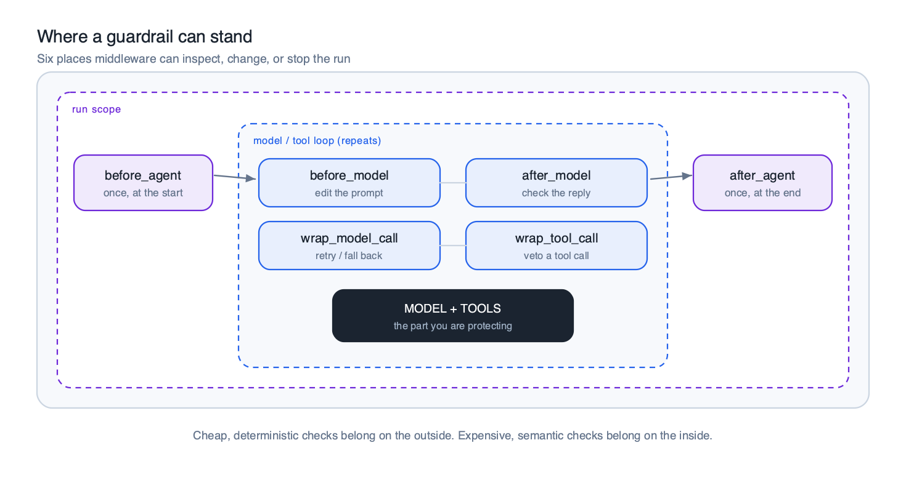
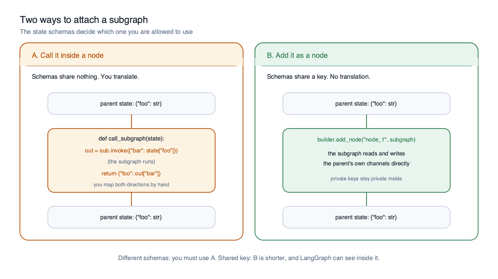

</div>

---

## Contents

- [Why this exists](#why-this-exists)
- [The notebooks](#the-notebooks)
- [Quick start](#quick-start)
- [Part A: Guardrails](#part-a-guardrails)
- [Part B: Subgraphs](#part-b-subgraphs)
- [Every notebook actually runs](#every-notebook-actually-runs)
- [Where the docs and the libraries disagree](#where-the-docs-and-the-libraries-disagree)
- [Repository layout](#repository-layout)
- [Regenerating everything](#regenerating-everything)
- [Sources](#sources)

---

## Why this exists

The official pages for [guardrails](https://docs.langchain.com/oss/python/langchain/guardrails)
and [subgraphs](https://docs.langchain.com/oss/python/langgraph/use-subgraphs) are accurate and
very terse. They give you stubs: a class with the body elided, a snippet whose imports are
implied, a table of options with no worked example.

That is fine as reference material and hard to teach from. So this repository takes every
example on both pages and does four things to it:

|   | |
|---|---|
| **Runs it** | Every code cell has been executed against real OpenAI calls, with the outputs saved in the notebook. |
| **Wraps a story around it** | Two companies, five notebooks. Northwind Health leaks a card number and spends three notebooks fixing it. Aurora Retail splits one huge graph across three teams. |
| **Shows the failure first** | You watch the unguarded agent write an SSN into the audit log before you see the guardrail that stops it. |
| **Tells you where the docs are wrong** | Two of the documented APIs do not match the shipping libraries. Both are [flagged below](#where-the-docs-and-the-libraries-disagree) and inline. |

Written to be projected. Simple language, one idea per section, and a diagram wherever a
paragraph would have been worse.

---

## The notebooks

Run them in this order. Guardrails is three notebooks, subgraphs is two, and each group is one
continuous story.

<table>
<thead>
<tr><th width="3%">#</th><th width="27%">Notebook</th><th width="30%">The story</th><th width="40%">What it covers</th></tr>
</thead>
<tbody>
<tr>
<td align="center"><b>1</b></td>
<td><a href="notebooks/01_guardrails_stopping_bad_input.ipynb"><code>01_guardrails_stopping_bad_input</code></a></td>
<td>Northwind Health leaks a member's card number into its compliance audit log</td>
<td>The six middleware hooks. Deterministic vs model-based. <code>PIIMiddleware</code>, its four strategies, custom detectors, and input vs output vs tool results. Writing your own <code>before_agent</code> guardrail in both class and decorator form. Vetoing one tool call with <code>wrap_tool_call</code>.</td>
</tr>
<tr>
<td align="center"><b>2</b></td>
<td><a href="notebooks/02_guardrails_judgement_and_approval.ipynb"><code>02_guardrails_judgement_and_approval</code></a></td>
<td>The same agent starts handing out medical advice</td>
<td>Model-based guardrails in <code>after_agent</code>. Measuring what a judge costs and how to gate it. Human in the loop and all four reviewer decisions. Six layers assembled into one agent, a scenario matrix, and a guardrail test table.</td>
</tr>
<tr>
<td align="center"><b>3</b></td>
<td><a href="notebooks/05_guardrails_redact_but_still_look_up.ipynb"><code>05_guardrails_redact_but_still_look_up</code></a></td>
<td>The member will not send their SSN to a model, but the lookup tool needs it</td>
<td>Why redaction is one way and cannot be undone. Tokenise and rehydrate with a vault. Per-tool allow lists. Rejecting placeholders the model invented. What your own checkpointer sees that the model does not. Session identity and out of band collection.</td>
</tr>
<tr>
<td align="center"><b>4</b></td>
<td><a href="notebooks/03_subgraphs_composing_graphs.ipynb"><code>03_subgraphs_composing_graphs</code></a></td>
<td>Aurora Retail splits one enormous graph across three teams</td>
<td>What a subgraph is. Calling one inside a node when the schemas share nothing. Adding one straight to <code>add_node</code> when they share a key. Parent to child to grandchild nesting, and what a namespace is. Three ways to stream a nested run.</td>
</tr>
<tr>
<td align="center"><b>5</b></td>
<td><a href="notebooks/04_subgraphs_memory_and_control.ipynb"><code>04_subgraphs_memory_and_control</code></a></td>
<td>Should the specialist remember the last question?</td>
<td>Per-invocation, per-thread and stateless persistence. Durable execution, shown by counting how many times an expensive node runs. Namespace isolation. Reading a subgraph's state from the parent. Human approval from inside a subgraph.</td>
</tr>
</tbody>
</table>

> **On the numbering.** Notebook `05` sits last on disk but belongs third in the class. It
> answers the question that always comes up once people have seen part 1: *"if you redact my
> SSN, how does the lookup tool ever find my record?"*

**Rough timings:** `01` about 35 min, `02` about 40, `05` about 40, `03` about 45, `04` about 40.

---

## Quick start

```bash
git clone https://github.com/fnusatvik07/guardrails-subgraphs.git
cd guardrails-subgraphs

python3 -m venv .venv
.venv/bin/pip install -r requirements.txt

cp .env.example .env          # then put your OpenAI key in it
.venv/bin/jupyter lab
```

Open anything in `notebooks/` and run it top to bottom. Every notebook is standalone, so you can
start the class at notebook 3 without having run 1 and 2.

### Cost and models

The five notebooks together make roughly 75 model calls against `gpt-5.4-mini`. To change the
model, edit two constants at the top of [`notebooks/classroom.py`](notebooks/classroom.py):

```python
WORKER_MODEL = "gpt-5.4-mini"   # does the actual work
JUDGE_MODEL  = "gpt-5.4-mini"   # the cheap model used for model-based guardrails
```

Notebooks 3 and 4 are deliberately almost model-free. Graph mechanics are far easier to teach
when the output is identical every time you run the cell.

---

## Part A: Guardrails

### Where a guardrail can stand

A guardrail is middleware: code that runs at a fixed point in the agent's execution and may
inspect what passes through, change it, or stop the run. There are six such points. Four sit
inside the model and tool loop and run every turn. Two sit outside it and run once per request.

<div align="center">

</div>

Cheap deterministic checks belong on the outside. Expensive semantic checks belong on the inside.

<br>

### Two flavours, and you want both

<div align="center">
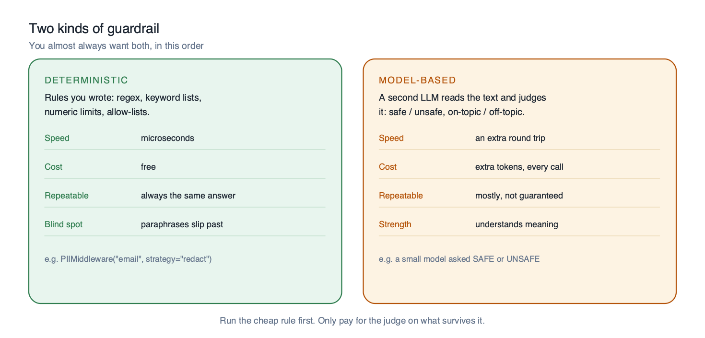
</div>

Run the cheap rule first and only pay for the judge on what survives it. Notebook 1 is entirely
deterministic guardrails. Notebook 2 adds the judge and measures what it costs.

<br>

### Four things you can do with PII

<div align="center">
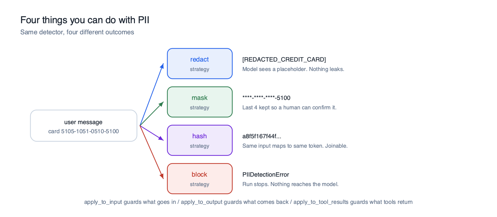
</div>

Guarding the input is the easy half. Most real leaks come back out of a **tool**, which is why
`apply_to_output` and `apply_to_tool_results` exist and why both default to off.

<br>

### Human in the loop is a pause, not a prompt

<div align="center">
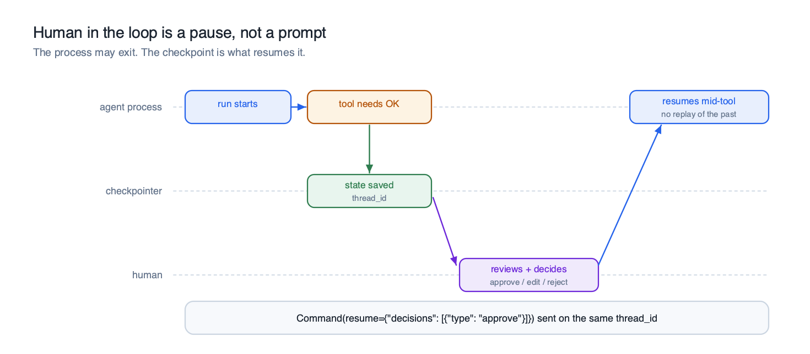
</div>

The agent does not block a thread waiting for a person. It writes its state to the checkpointer
and returns. Your process may exit. Tomorrow a reviewer clicks approve somewhere else entirely
and the run picks up at the exact tool call it stopped on.

<br>

### Defence in depth

<div align="center">
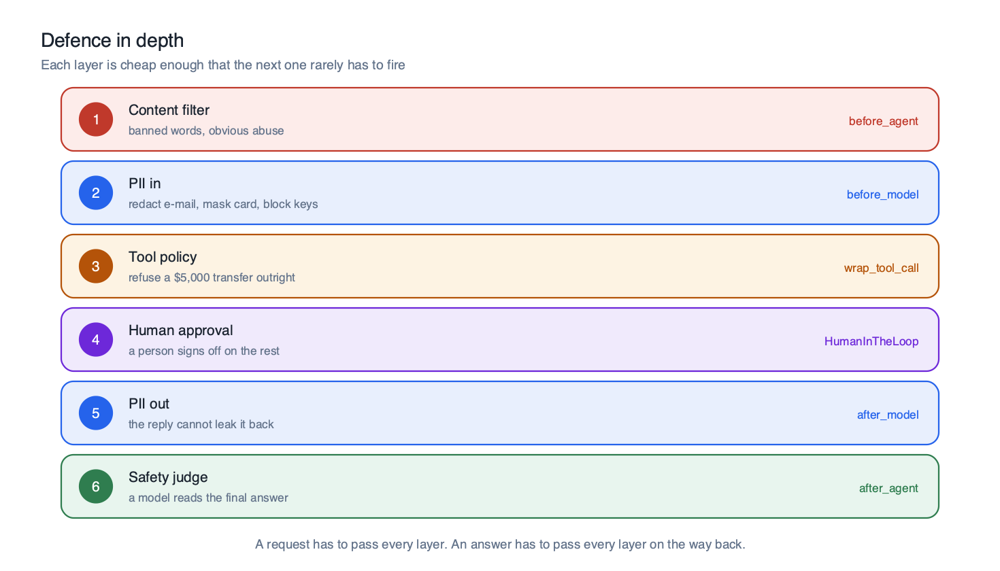
</div>

Notebook 2 assembles all six and pushes a scenario matrix through them. Every row takes a
different path, and the ordinary question in row one still gets a normal answer. That last part
is the hard bit: it is easy to build guardrails that make an agent useless.

<br>

### The awkward one: redacted for the model, real for the tool

> *"I do not want to send my SSN to the model. But I still want the agent to look my details up."*

`PIIMiddleware` cannot do this. Redact, mask and hash are all one way **by design**. Once the
model sees `[REDACTED_SSN]`, nothing turns that back into a number, and your lookup tool receives
a useless string. Notebook `05` opens by demonstrating exactly that failure, then builds the
thing that works.

<div align="center">
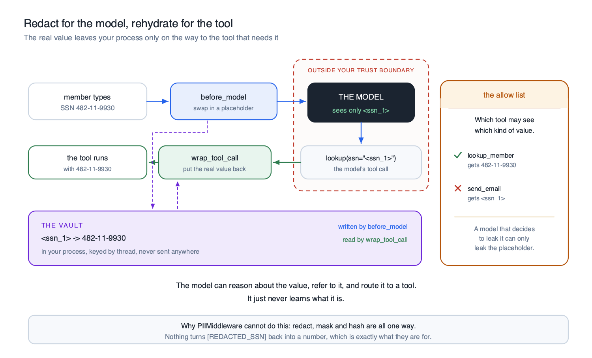
</div>

The model can reason about the value, refer to it, and route it to a tool. It just never learns
what it is. The **allow list** is the part that contains the blast radius: a model that decides
to leak the value can only leak the placeholder.

Before reaching for any of that, check whether one of the two simpler options applies:

<div align="center">
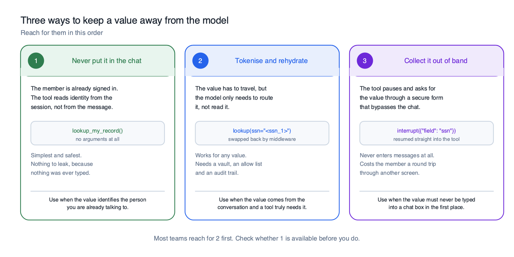
</div>

---

## Part B: Subgraphs

### A subgraph is a graph used as a node

<div align="center">
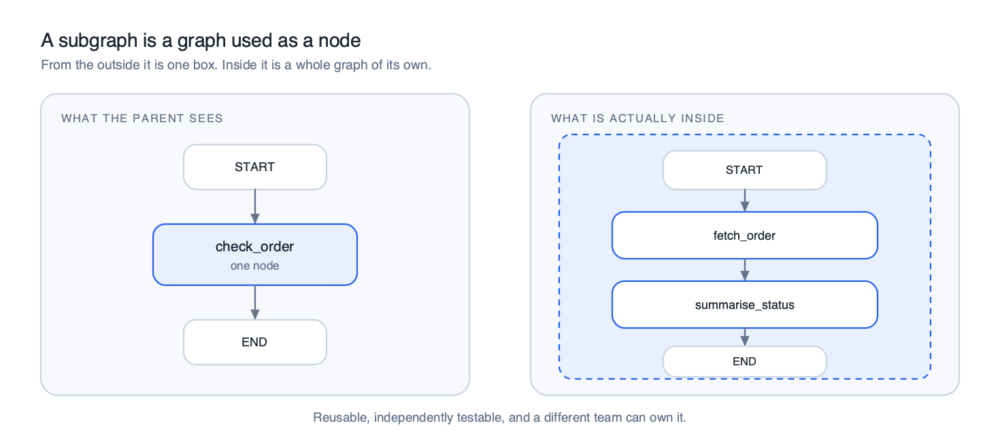
</div>

From the parent it is one box. Inside it is a full graph with its own state, nodes and edges.
Reusable, independently testable, and a different team can own it.

<br>

### Two ways to attach one

Everything follows from a single question: **does the subgraph read and write the same state keys
as the parent?**

<div align="center">

</div>

<br>

### Nesting and namespaces

<div align="center">
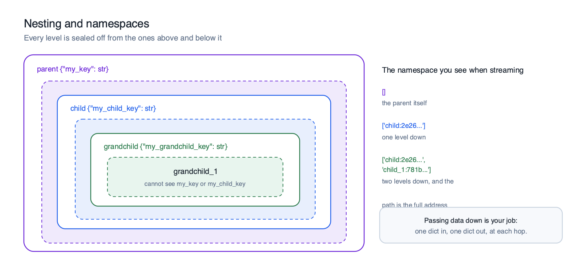
</div>

Every level is sealed off from the ones above and below it. The namespace you see when streaming
is literally the address of a running subgraph, and it grows one segment per level of nesting.
If you have ever debugged a nested agent system and wondered where a value came from, that path
is the answer.

<br>

### Three ways a subgraph can remember

<div align="center">
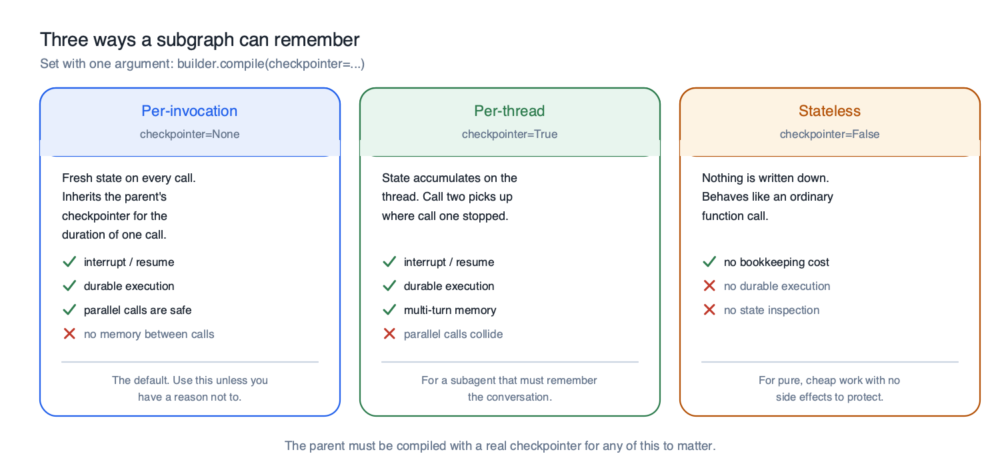
</div>

Notebook 5 proves each column by running it. The sharpest demo is durable execution: across a
pause and a resume, a per-invocation subgraph runs its expensive node **once**, and a stateless
one runs it **twice**. If that node charges a card, somebody notices.

<br>

### Why per-thread subagents need their own name

<div align="center">
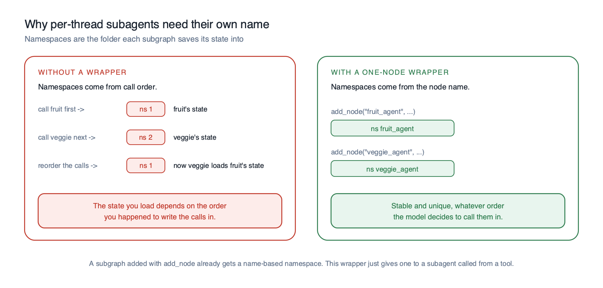
</div>

<br>

### Seeing inside a running subgraph

<div align="center">
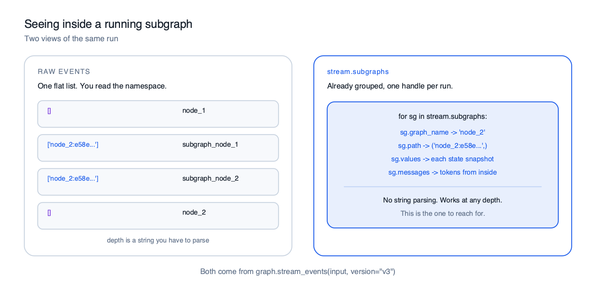
</div>

---

## Every notebook actually runs

Not "should run". Every cell was executed from a clean kernel against the real API, and the
outputs are committed.

| Notebook | Cells | Code cells | Executed | Errors | Warnings |
|---|---:|---:|---:|---:|---:|
| `01_guardrails_stopping_bad_input` | 37 | 14 | 14 | 0 | 0 |
| `02_guardrails_judgement_and_approval` | 32 | 14 | 14 | 0 | 0 |
| `03_subgraphs_composing_graphs` | 41 | 17 | 17 | 0 | 0 |
| `04_subgraphs_memory_and_control` | 28 | 9 | 9 | 0 | 0 |
| `05_guardrails_redact_but_still_look_up` | 41 | 16 | 16 | 0 | 0 |
| **Total** | **179** | **70** | **70** | **0** | **0** |

Re-verify it yourself at any time:

```bash
cd notebooks
../.venv/bin/jupyter nbconvert --to notebook --execute --inplace \
    --ExecutePreprocessor.timeout=1500 *.ipynb
```

---

## Where the docs and the libraries disagree

Two things on the official pages do not match the shipping libraries. Students hit both, so they
are called out inline in the notebooks as well as here.

<details open>
<summary><b>1. <code>create_agent(prompt=...)</code> is actually <code>system_prompt=</code></b></summary>

<br>

The guardrails page writes `create_agent(model=..., prompt="You are ...")`. In `langchain 1.3.18`
the argument is `system_prompt`. Passing `prompt` raises:

```
TypeError: create_agent() got an unexpected keyword argument 'prompt'
```

All five notebooks use `system_prompt`.

</details>

<details open>
<summary><b>2. <code>updates</code> stream events need their transformer registered</b></summary>

<br>

The subgraphs page prints nested runs like this:

```python
stream = graph.stream_events({"foo": "foo"}, version="v3")
for event in stream:
    if event["method"] == "updates":
        print(event["params"]["namespace"], event["params"]["data"])
```

In `langgraph 1.2.11` the `updates` projection is **opt-in**, so that loop prints nothing at all.
It needs the transformer:

```python
from langgraph.stream.transformers import UpdatesTransformer

stream = graph.stream_events({"foo": "foo"}, version="v3",
                             transformers=[UpdatesTransformer])
```

Notebook 3 shows that fix plus two alternatives that need no extra import, including
`stream.subgraphs`, which is the one to reach for.

</details>

---

## Repository layout

```
guardrails-subgraphs/
├── notebooks/
│   ├── 01_guardrails_stopping_bad_input.ipynb
│   ├── 02_guardrails_judgement_and_approval.ipynb
│   ├── 03_subgraphs_composing_graphs.ipynb
│   ├── 04_subgraphs_memory_and_control.ipynb
│   ├── 05_guardrails_redact_but_still_look_up.ipynb
│   └── classroom.py                 printing helpers only, no LangChain logic
├── images/
│   ├── diagrams/                    13 diagrams written for this class, SVG + PNG
│   │   ├── mermaid.md               Mermaid source, for draw.io or slides
│   │   └── README.md                how to regenerate them
│   └── original/                    the two images taken from the docs pages
├── tools/                           generators for the diagrams and the notebooks
│   ├── svgkit.py
│   ├── make_guardrail_diagrams.py
│   ├── make_subgraph_diagrams.py
│   ├── make_vault_diagrams.py
│   ├── nbbuild.py
│   └── nb01.py ... nb05.py
├── requirements.txt
└── .env.example
```

[`notebooks/classroom.py`](notebooks/classroom.py) contains no LangChain logic whatsoever. It is
transcript printing, table printing, `.env` loading, and a thin wrapper around
`graph.get_graph().draw_ascii()`. It exists so the notebooks stay about the ideas rather than
about formatting message lists.

---

## Regenerating everything

Both the diagrams and the notebooks are generated from source, so nothing here is a dead end.

```bash
# diagrams (SVG, then PNG previews)
.venv/bin/python tools/make_guardrail_diagrams.py
.venv/bin/python tools/make_subgraph_diagrams.py
.venv/bin/python tools/make_vault_diagrams.py
.venv/bin/python -c "import cairosvg,glob; [cairosvg.svg2png(url=f, \
    write_to=f.replace('.svg','.png'), scale=1.5) for f in glob.glob('images/diagrams/*.svg')]"

# notebooks
for n in 01 02 03 04 05; do .venv/bin/python tools/nb$n.py; done
```

Rebuilding a notebook from `tools/nbNN.py` wipes its saved outputs, so run the `nbconvert` step
from [Every notebook actually runs](#every-notebook-actually-runs) afterwards to put them back.

The diagrams are drawn by a small SVG helper in [`tools/svgkit.py`](tools/svgkit.py), so they
have no runtime dependency and stay legible when projected. Mermaid equivalents of the
structural ones live in
[`images/diagrams/mermaid.md`](images/diagrams/mermaid.md) if you would rather edit them in
draw.io via **File > Import from > Mermaid**.

---

## Sources

| | |
|---|---|
| Guardrails | <https://docs.langchain.com/oss/python/langchain/guardrails> |
| Middleware | <https://docs.langchain.com/oss/python/langchain/middleware> |
| Human in the loop | <https://docs.langchain.com/oss/python/langchain/human-in-the-loop> |
| Subgraphs | <https://docs.langchain.com/oss/python/langgraph/use-subgraphs> |
| Graph API | <https://docs.langchain.com/oss/python/langgraph/graph-api> |
| Persistence | <https://docs.langchain.com/oss/python/langgraph/persistence> |
| Event streaming | <https://docs.langchain.com/oss/python/langgraph/event-streaming> |

The two images in `images/original/` are taken from the LangChain and LangGraph documentation
and are reproduced here so a class can compare them with the versions drawn for this repository.

---

## License

[MIT](LICENSE). Use it, fork it, teach from it.
