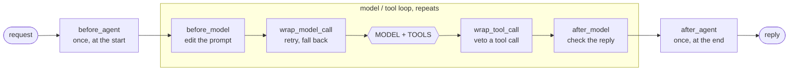
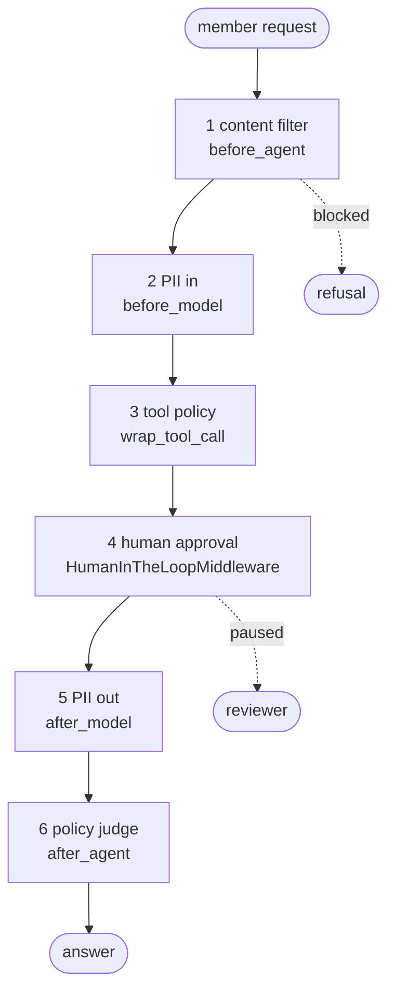
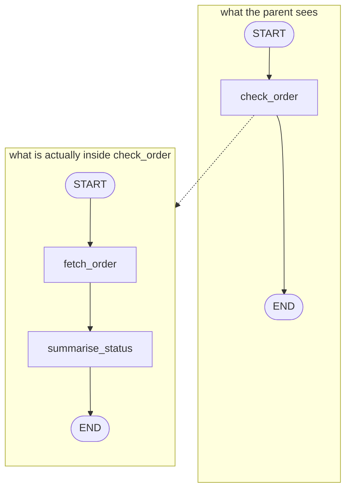
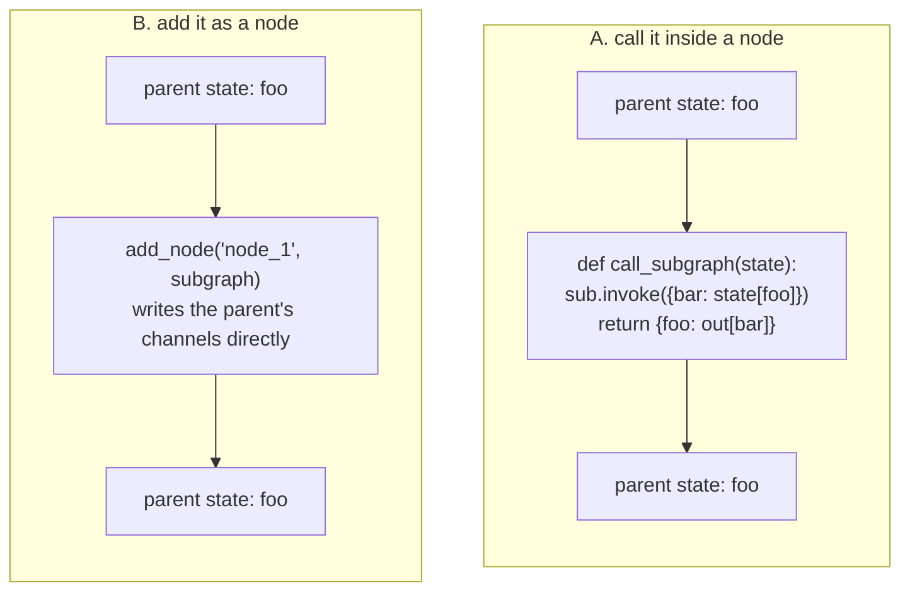
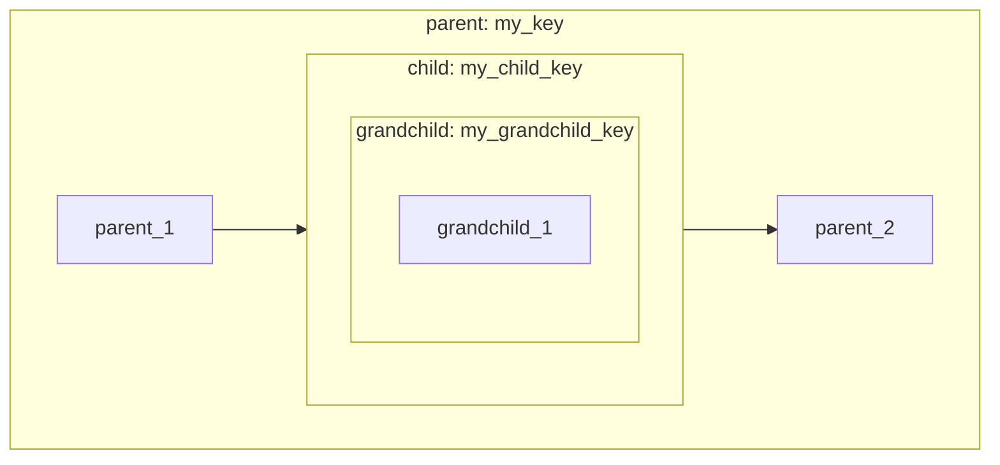
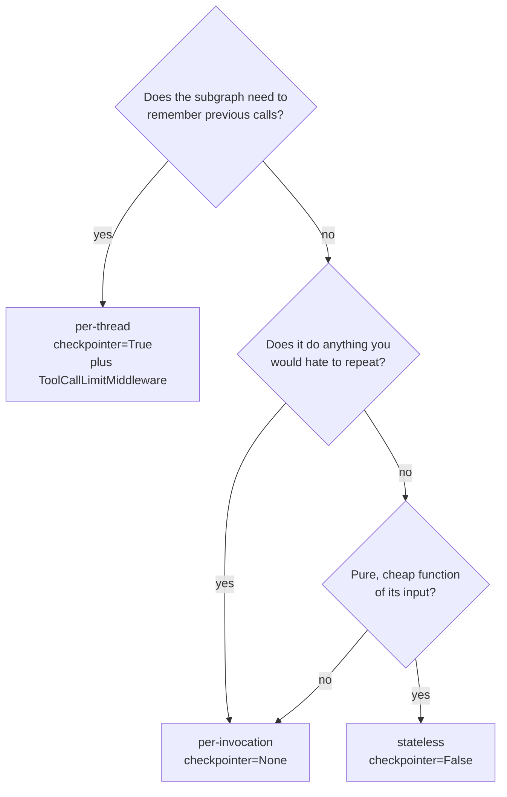

# Mermaid source for the structural diagrams

Paste any of these into a slide tool, or import into draw.io with
**File > Import from > Mermaid**. They are simplified versions of the SVGs in
this folder, kept editable.

---

## Where a guardrail can stand

## Defence in depth

## A subgraph seen from outside and inside

## The two ways to attach a subgraph

## Nesting and namespaces

## Choosing a persistence mode

